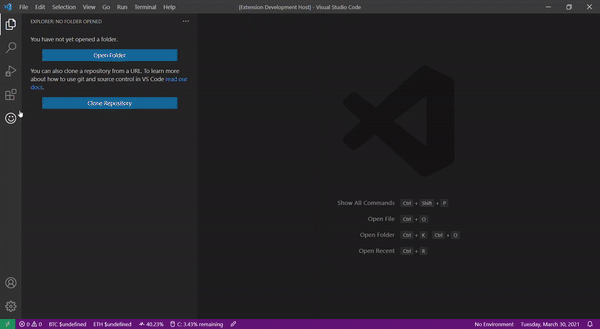

# LIHKG Viewer README

A vscode extension for browsing LIHKG's posts in markdown document mode.

## Install the latest version

1. download vs-lihkg-[version no].vsix here 
2. Open the Extensions tab and click "install from VSIX" and select above file
3. enjoy!

## Features

Open lihkg as a markdown document. For the further feather have not designed. Welcome to suggest.

## Requirements

vs-code version >= 1.39.0

<!-- ### Extension Settings

#None

## Known Issues

None -->

## Release Notes

### 0.2.0

- add "open in browser"
- add current page at status bar, click this to jump page

### 0.1.1

- initial version

---

**Enjoy!**
